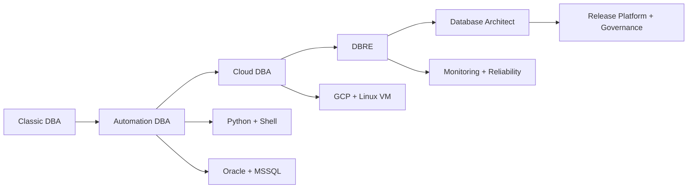

<div align="center">


<br/>

<a href="https://github.com/bozpain?tab=repositories">
  
</a>


</div>

---

## 👋 About Me

Hi, I'm **bozpain** — a Database Engineer focused on building modern DBA automation and database release platforms.

I work around **Oracle**, **Microsoft SQL Server**, **Linux**, **Python**, **Shell scripting**, and **CI/CD database delivery**.  
My current direction is moving from classic DBA work into **Cloud DBA / DBRE / Database Architect** skills.

```yaml
role: Database Automation Engineer
focus:
  - Oracle Database automation
  - Microsoft SQL Server operations
  - Database CI/CD and release governance
  - Patch, install, replication, validation, rollback
  - Monitoring and operational excellence
current_goal: Build a modern DBA automation portal and database release platform
```

---

## 🚀 Featured Projects

<div align="center">

<table>
<tr>
<td width="50%">

### 🧩 Oracle Patch Framework
Automation framework for Oracle database patching workflow.

**Highlights**
- Patch orchestration
- Pre-check and post-check
- Validation-ready structure
- Python-based automation

<a href="https://github.com/bozpain/oracle-patch-framework">
  
</a>

</td>
<td width="50%">

### 🏗️ Oracle Install Replication Framework
Automation framework for Oracle installation and replication setup.

**Highlights**
- Oracle install automation
- Replication preparation
- Repeatable DBA workflow
- Python-based tooling

<a href="https://github.com/bozpain/oracle-install-replication-framework">
  
</a>

</td>
</tr>

<tr>
<td width="50%">

### 🔄 Oracle Replication Framework
Framework for Oracle replication automation and operational tasks.

**Highlights**
- Replication workflow
- Operational scripting
- Standardized execution
- Python foundation

<a href="https://github.com/bozpain/oracle-replication-framework">
  
</a>

</td>
<td width="50%">

### 🖥️ DBA Automation Portal
Portal concept for centralizing DBA automation and monitoring links.

**Highlights**
- DBA self-service portal
- Automation UI direction
- Monitoring integration concept
- Shell-based foundation

<a href="https://github.com/bozpain/dba-automation-portal">
  
</a>

</td>
</tr>
</table>

</div>

---

## 🛠️ Tech Stack

<div align="center">

### Database


### Automation & Scripting


### DevOps & Delivery


### Cloud & Platform


</div>

---

## 🧭 Current Roadmap



---

## 📊 GitHub Analytics

<div align="center">


<br/><br/>


</div>

---

## ⚡ What I'm Building

<div align="center">

| Area | Goal |
|---|---|
| 🧩 Oracle Patch Automation | Safer, repeatable patch workflow |
| 🏗️ Oracle Install & Replication | Faster environment preparation |
| 🔄 Database CI/CD | GitLab + Liquibase release pipeline |
| ✅ Release Governance | Approval, checklist, rollback, audit |
| 📈 Observability | Monitor database impact after deployment |
| 🖥️ DBA Portal | One modern UI for automation and monitoring |

</div>

---

## 🏆 GitHub Trophy

<div align="center">


</div>

---

## 🌈 Activity Graph

<div align="center">


</div>

---

## 🤝 Let's Connect

<div align="center">

<a href="https://github.com/bozpain">
  
</a>

<br/><br/>


</div>
